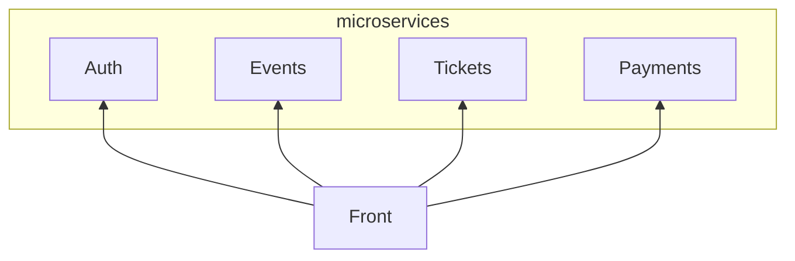

# Geeble

[Open PR master -> production](https://github.com/tchenu/geeble/compare/production...master?expand=1)

[Open PR master -> preproduction](https://github.com/tchenu/geeble/compare/preproduction...master?expand=1)
## Stack

- 📦 API Platform
- 📦 Nuxt 3
- 📦 NestJS
- 🔎 Meilisearch
- 💿 Postgresql
- 💭 MQTT
- ☁️ Heroku
- ☁️ Vercel

## Setup

```bash
  docker-compose up -d
  docker-compose logs - f #Wait then everything is ok

  # API Platform
  ./auth/bin/console.sh doctrine:fixtures:load

  # Events - Microservice - Port 3000
  cp ./events/.env.example ./events/.env
  cd events
  yarn
  npx prisma generate
  npx prisma migrate deploy
  npx prisma db seed
  yarn start:run

  # Tickets - Microservice - Port 3001
  cp ./tickets/.env.example ./tickets/.env
  cd tickets
  yarn
  npx prisma generate
  npx prisma migrate deploy
  npx prisma db seed
  yarn start:run

  # Payments - Microservice - Port 3002
  cp ./payments/.env.example ./payments/.env
  cd payments
  yarn
  npx prisma generate
  npx prisma migrate deploy
  yarn start:run

```

## Infrastructure

<!-- generated by mermaid compile action - START -->


<details>
  <summary>Mermaid markup</summary>



</details>
<!-- generated by mermaid compile action - END -->
