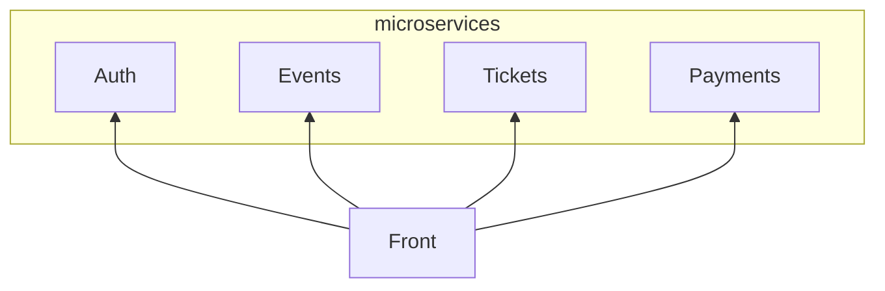

# Geeble

[Open PR master -> production](https://github.com/tchenu/geeble/compare/production...master?expand=1)

[Open PR master -> preproduction](https://github.com/tchenu/geeble/compare/preproduction...master?expand=1)

## Stack

- 📦 API Platform
- 📦 Nuxt 3
- 📦 NestJS
- 🔎 Meilisearch
- 💿 Postgresql
- 💭 MQTT
- ☁️ Heroku
- ☁️ Vercel

## Setup

@TODO

## Infrastructure

<!-- generated by mermaid compile action - START -->

  
Mermaid markup

<!-- generated by mermaid compile action - END -->
